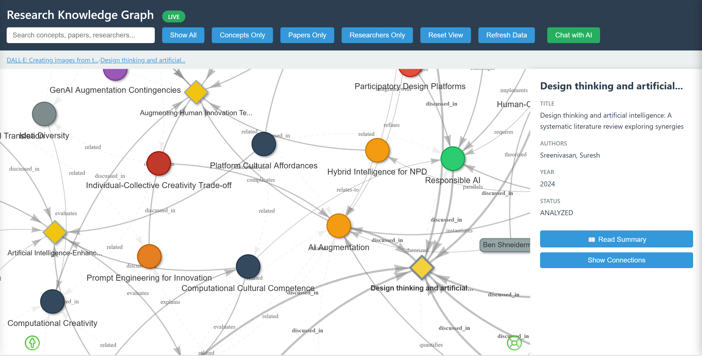

# Knowledge Graph Kit

A configurable toolkit for building, exploring, and sharing knowledge graphs — served as an interactive web page you can hand to anyone, with no graph database to stand up.

I do a lot of systems and ecosystem mapping in my design practice — stakeholder networks, value flows, research synthesis — and kept rebuilding the same scaffolding every time: a way to turn a pile of interconnected notes into something you can actually *click through* and reason about. This kit is that scaffolding, generalised. Point it at a domain, pick a template, and you get a browseable graph with provenance tracking, search, and an optional AI chat layered over the top.

**[Explore the live demo →](https://earlyprototype.github.io/knowledge-graph-kit/)** — an ecosystem map of my own public projects, built with this kit. It's also what the map on my GitHub profile links to.

**[See it deployed in the wild →](https://earlyprototype.github.io/fxc-service-map/)** — the FactoryXChange 2.0 Service Map, an interactive service finder built with this kit for the FactoryXChange programme with Irish Manufacturing Research.

<div align="center">



</div>

<div align="center">


[Quick Start](#quick-start) • [Templates](#templates) • [Documentation](#documentation)

</div>

---

## Features

- **🎯 5 Pre-built Templates** - Research, Systems Mapping, Ecosystem Mapping, Evidence, Generic
- **🎨 Interactive Visualization** - Click, explore, and navigate your knowledge graph
- **🤖 AI Integration** - Optional Gemini chat for insights and exploration
- **📊 Provenance Tracking** - Track where each concept came from
- **🔧 Fully Configurable** - Customize entity types, relationships, and visuals via YAML
- **💻 Simple Setup** - Interactive wizard walks you through everything
- **🕰️ Timeline Scrubber** - Replay a graph's history by date (Evidence template)
- **⚖️ Epistemic Status** - Colour claims by whether they still stand (Evidence template)

---

## Quick Start

### Interactive Setup (Recommended)

```bash
cd knowledge-graph-kit
python setup_wizard.py
```

The wizard will:
1. Help you choose a template
2. Configure AI integration (optional)
3. Set up your project
4. Launch the viewer

**Takes 2-5 minutes.**

### Manual Setup

```bash
# 1. Choose and copy a template
cp -r templates/research ./my-project

# 2. Install dependencies
pip install -r requirements.txt

# 3. Initialize
cd my-project
python init.py

# 4. Start the server
python server.py  # Basic
# or
python start_server.py  # With AI chat
```

Open **http://localhost:8000/viewer.html** in your browser.

---

## Templates

Choose the template that fits your use case:

### 🎓 Research
**For:** Academic papers, literature reviews, systematic analysis

**Entities:** Concepts, Researchers, Papers  
**Use Cases:** Literature synthesis, concept mapping, citation networks

### 🏗️ Systems Mapping
**For:** Systems thinking, complex systems analysis, organizational systems

**Entities:** Components, Teams, Specifications  
**Use Cases:** Systems thinking, dependency mapping, impact analysis, systems documentation

### 🌐 Ecosystem Mapping
**For:** Stakeholder analysis, value flows, organizational networks

**Entities:** Elements, Stakeholders, Insights  
**Use Cases:** Ecosystem analysis, power mapping, value chain visualization

### ⚖️ Evidence
**For:** Experimental programmes, claim tracking, anything where findings get corrected

**Entities:** Claims, Runs, Sources  
**Use Cases:** Hypothesis-to-finding chains, self-correction audits, provenance of a result

Claims carry an epistemic **status** (`supported`, `refuted`, `not-supported`, `qualified`, `retired`, `corrected`, `open`, `untested` — `not-supported` being the null result, distinct from a refutation) and edges carry **force** — `supports`/`refutes`/`qualifies`/`corrects`/`retires`/`supersedes`/`tests` — so the graph records not just what connects to what but what a result *did* to a prior belief. A timeline scrubber replays the programme by `asserted`/`retired` date.

### ⚙️ Generic
**For:** Custom domains not covered above

**Entities:** Fully customizable  
**Use Cases:** Anything else - you define the schema

[See full template comparison →](TEMPLATES.md)

---

## Example Usage

### Quick Start Code

```python
from core.graph_manager import GraphManager

# Initialize
gm = GraphManager('config.yaml')

# Add entities
gm.add_entity('primary', {
    'id': 'design-thinking',
    'label': 'Design Thinking',
    'type': 'methodology',
    'description': 'User-centered, iterative innovation process',
    'source_papers': ['paper-001']
})

# Add relationships
gm.add_relationship('design-thinking', 'human-centered-design', 'relates-to')

# Save
gm.save()
```

### 📊 Complete Working Example

See a **real systems map** of the Knowledge Graph Kit codebase itself:

```bash
# From the repo root:
(cd examples/systems-map-example && python build_map.py)
python core/server.py --directory examples/systems-map-example
# Opens at http://localhost:8000/viewer.html
```

**Includes:** 20 entities (16 components, 1 team, 3 docs), 39 relationships

[View example documentation →](examples/systems-map-example/EXAMPLE_README.md)

---

## Viewer Features

<div align="center">

| Feature | Description |
|---------|-------------|
| **Interactive Graph** | Drag, zoom, and explore nodes |
| **Smart Search** | Find entities by name or description |
| **Click-through Navigation** | Navigate between related entities |
| **Show Connections** | Focus on subgraphs |
| **Breadcrumb Trail** | Track your exploration path |
| **Document Panel** | View source documents inline |
| **Timeline Scrubber** | Replay the graph by date, with play/pause (Evidence) |
| **Status & Type Filters** | Chip rows to show/hide by status or entity type (Evidence) |
| **Copy Evidence Chain** | Copy a claim's provenance chain as plain text (Evidence) |
| **AI Chat** | Ask questions about your graph (optional) |

</div>

---

## Project Structure

```
your-project/
├── config.yaml              # Configuration
├── _data/
│   └── entities.json        # Your knowledge graph
├── viewer.html              # Interactive visualization
├── server.py                # HTTP server
└── README.md                # Template docs
```

---

## Configuration

All templates use YAML configuration:

```yaml
domain: research

entity_types:
  primary:
    name: concepts
    types: [methodology, framework, technology]
  
  contributors:
    name: researchers
  
  sources:
    name: papers

relationships:
  types: [extends, builds-on, challenges]

visualization:
  colors:
    methodology: "#3498db"
    framework: "#9b59b6"
```

[See the Generic template guide for all config options →](templates/generic/README.md)

---

## AI Integration (Optional)

Enable Gemini AI chat for:
- Asking questions about your graph
- Finding patterns and connections
- Getting synthesis insights

**Setup:**
1. Get API key from [Google AI Studio](https://makersuite.google.com/app/apikey)
2. Run setup wizard and choose "Enable Gemini"
3. Or manually: copy `gemini_config.template.json` to `gemini_config.json` and add your key

---

## Documentation

- **[Template Comparison](TEMPLATES.md)** - Detailed comparison of all templates
- **[Examples](examples/)** - Code examples for common tasks
- **Template READMEs** - In each template directory

---

## Requirements

- Python 3.7+
- PyYAML
- google-generativeai (for AI features)

```bash
pip install -r requirements.txt
```

---

## Use Cases

### Academic Research
- Build cumulative knowledge from papers
- Track concept evolution across sources
- Identify research gaps
- Generate literature reviews

### Systems Mapping & Thinking
- Map system dependencies and relationships
- Understand complex systems and feedback loops
- Analyze system dynamics and interactions
- Track ownership and specifications

### Ecosystem Analysis
- Map stakeholder relationships
- Analyze power structures
- Trace value flows
- Identify collaboration opportunities

### Evidence & Claim Tracking
- Trace a finding back to the run that produced it
- Record which results corrected, retired or superseded earlier ones
- See at a glance which claims still stand
- Replay how the picture changed over the life of a programme

---

## Contributing

This began as my own tool, so it's shaped around how I work — which leaves plenty of room to make it more general. If you build a new template or a better layout, I'd like to see it: open an issue or a PR.

---

## License

MIT License - see [LICENSE](LICENSE) for details.

---

## Acknowledgements

Built out of my systems-design practice, for anyone who needs to see how the pieces of a complex system actually connect.

